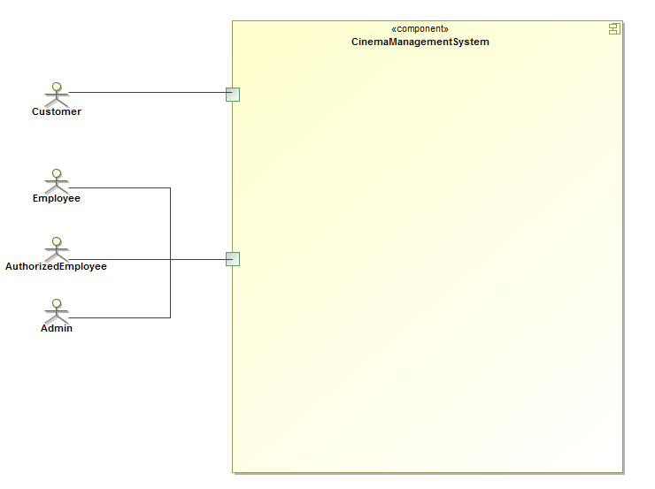
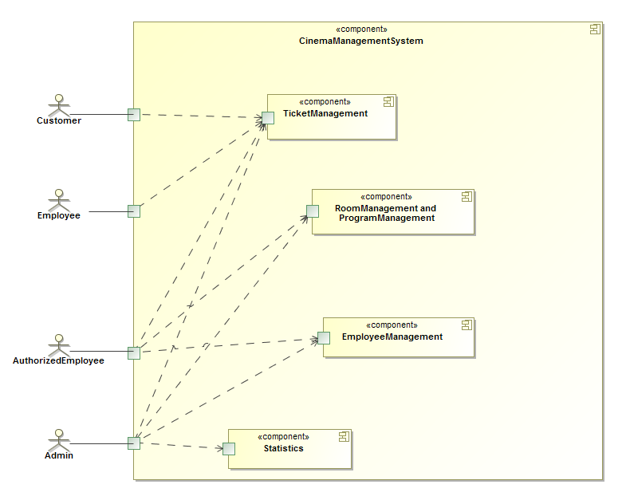
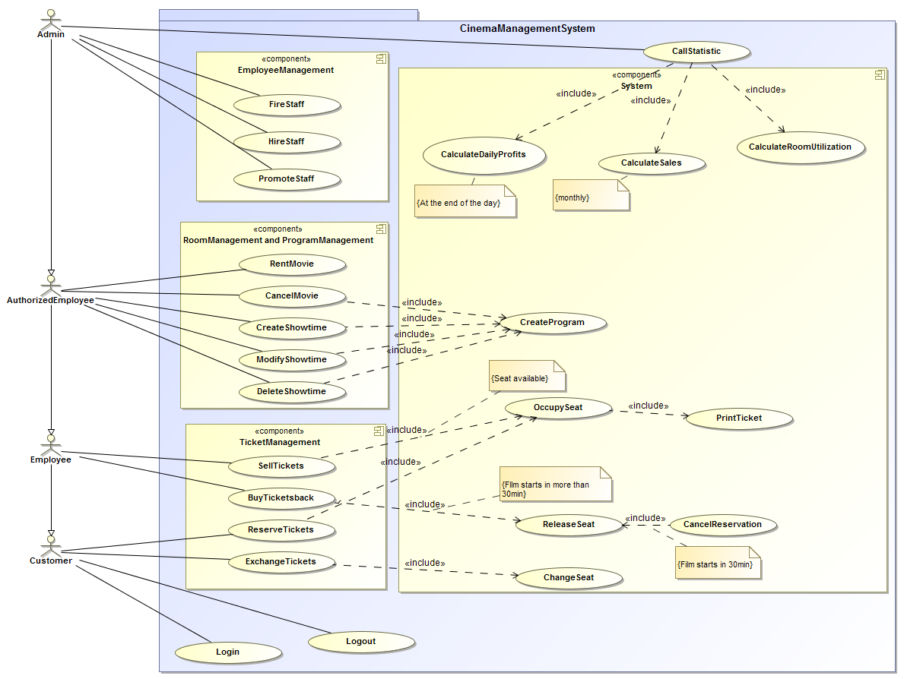

= Entwicklerdokumentation

== Einführung und Ziele

Dieses Dokument umreißt den Entwurf und die Architektur für die Software des Projekted der Gruppe 19.
Es werden die Planungen für die Aufgaben der Klassen und ihre Beziehungen untereinander umrissen, Grundkonzepte für die Programmstruktur beschrieben und das grafische Design der Benutzeroberfläche dargelegt.

*Aufgabenstellung*

Aufgabe ist die Erstellung einer kompletten Software für das Ufo-Kino-Unternehmen mit Back- und Frontend unter Verwendung der Spring- und Salespoint-Frameworks. Die Software soll im Browser leicht verwendbar sein, und sowohl den Kunden als auch den Angestellten Zugriff und Funktionen bieten.

Kunden haben die Möglichkeit über die Website Karten zu kaufen oder zu reservieren. Dazu können sie sich mit einem eigenene Account einloggen oder sich über ihre Email-Adresse identifizieren. Die Auswahl der Karten wird über einen grafischen Platzwähler realisiert, welcher auch gleichzeitig die noch zur Verfügung stehenden Plätze farbig hervorhebt.
Alternativ können Kunden ihre Karten vor Ort an der Kinokasse über einen Angestellten kaufen oder die Reservierungen bezahlen, Karten umtauschen oder zurück geben.
Angestellte mit zusätzlicher Autorisierung haben dazu noch die Möglichkeit den Programmablauf aufzustellen und können einzelne Vorstellungen erstellen, bearbeiten und löschen. Ein Zugriff auf Listen weiterer Filme, welche angemietet werden können, soll ebenfalls bestehen um dem Kino zu ermöglichen, sein Angebot auf einfachste Weise zu erweitern.

Als zusätzliche Funktionen für den Chef des Unternehmens besteht über die Website Zugriff auf die Verwaltung seines Personals. Er kann die Daten seiner Angestellten ändern, neue Kräfte einstellen und bestehende Mitarbeiter befördern oder entlassen. Zusätzlich bietet sie ihm auch die Möglichkeit, Daten zu geliehenen Filme zu ändern.
Für die übersichtliche Einsicht in alle Daten des Kinos bietet die Seite auch Statistiken über die Besucherzahlen, Einnahmen und Ausgaben, sowie Zugriff auf Daten vergangener Vorstellungen.

*Qualitätsziele*

Oberstes Qualitätsziel der Software ist ihre fehlerfreie und stabile Funktion sowohl auf dem Geräten des Kinos als auch unter Verwendung durch die Kunden zu Hause, wobei auch eine leichte Erweiterbarkeit gegeben sein soll um ohne größere Probleme auf weitere Funktionswünsche des Unternehmens eingehen zu können. 
Die Web-Oberfläche soll in allen Benutzerbereichen einheitlich und auch für neue Nutzer klar und effizient navigierbar sein. Größere Verzögerungen zwischen Benutzereingaben und Software-Reaktionen sollen nicht existieren.

== Randbedingungen

.Hardware-Vorgaben
* Client: Rechner mit Maus, Tastatur oder Mobilgerät, Internetzugang
* Server: Rechner, Internetzugang

.Software-Vorgaben
* Client: Internet-Browser mit HTML-5 Unterstützung, JavaScript optional
* Server: Java JDK 1.8

.Vorgaben zum Betrieb des Software
* bestehende, durchgängige Internetverbindung an Client und Server
* HTTP-Requests und Javascript-Befehle werden gesendet und verarbeitet
* Der mitgelieferte SMTP-Server muss zum reibungslosen Betrieb der Software laufen. Er simuliert den Email Versand zum Kunden.

== Kontextabgrenzung

Die Software umfasst vier verschiedene Zugriffsarten, welche über die verschiedenen Benutzerlevel gelöst werden sollen.

Der Zugriff wird über die vier Benutzerlevel geregelt. Sie interagieren auf unterschiedliche Weise mit den Komponenten der Software.
Der Kino-Kunde selbst hat nur beschränkten Zugriff auf die Kartenverwaltung.
Angestelle des Kinos können ebenfalls nur auf die kartenverwaltung zugreifen, können aber ihrer gesamte Funktionalität ausnutzen.
Autorisierte Kino-Angestellte haben zusätzlich Rechte in Bereich der Programm- und Raumverwaltung.
In einer Rolle als Systemadmin hat der Chef des Kinos alle Rechte seinen Angestellten und zusätzlich Zugriff auf die Personalverwaltung und die Statistiken.

*Externe Schnittstellen*

Die Softwarelösung soll den Benutzern folgende Aktionen ermöglichen:

[options="header"]
|===
|Akteur |Aktion |Beschreibung
|Alle |Login |Funktion zum Einloggen eines Benutzers.
|Alle |Logout |Funktion zum Ausloggen eines Benutzers.
|Alle |Karten kaufen  |Funktion zum Kauf einer oder mehrerer Karten.
|Alle |Karten reservieren |Funktion zur Reservierung einer oder mehrerer Karten.
|Angestellter, Autorisierter, Chef  |Karten zurückgeben |Funktion Für die Rückgabe von Karten. Dies ist für Kunden nur mit Hilfe eines Angestellten möglich.
|Angestellter, Autorisierter, Chef |Karten tauschen |Funktion für den Austausch von Karten.
|Angestellter, Autorisierter, Chef |Karten verkaufen  |Funktion für den Verkauf von Karten an der Kinokasse.
|Autorisierter, Chef |Film ausleihen  |Funktion für die Ausleihe eines neuen Films über externe Kataloge.
|Autorisierter, Chef |Film absetzen  |Funktion zum Herausnehmen eines Films aus der Liste der für das Kinoprogramm zur Verfügung stehenden Filme.
|Autorisierter, Chef |Vorstellung erstellen  |Funktion zur Erstellung einer neuen Vorstellung für einen zur Verfügung stehenden Film.
|Autorisierter, Chef |Vorstellung bearbeiten  |Funktion zur Bearbeitung einer bestehenden Vorstellung.
|Autorisierter, Chef |Vorstellung löschen  |Funktion zum Löschen einer bestehenden Vorstellung.
|Chef |Personal einstellen  |Funktion zum Einstellen eines neuen Personalmitglieds.
|Chef |Personal bearbeiten  |Funktion zum Bearbeiten eines bestehenden Personalmitglieds.
|Chef |Personal befördern  |Funktion zum Befördern eines bestehenden Personalmitglieds.
|Chef |Personal entlassen  |Funktion zum Löschen eines bestehenden Personalmitglieds.
|Chef |Statistik einsehen  |Funktion für das Anzeigen der verschiedenen Statistiken.
|System |Tageseinnahmen berechnen |Funktion zur Berechnung der Tageseinnahmen täglich zu einem festgelegten Zeitpunkt.
|System |Monatsumsatz berechnen |Funktion zur Berechnung des Monatsumsatzes.
|System |Raumauslastung berechnen |Funktion zur Berechnung der Raumauslastung einer bestimmten Vorstellung oder eines Films.
|System |Programm erstellen |Funktion zur Erstellung eines kompletten Wochenprogramms aus den bestehenden Vorstellungen. Dies passiert im Hintergrund der Vorstellungsbearbeitung.
|System |Platz belegen |Funktion für die Belegung eines Platzes is einem Kinosaal bei Verkauf oder Reservierung seiner zugehörigen Karte.
|System |Platz freigeben |Funktion für die Freigbe eines belegten Platzes für den Verkauf. Dies geschieht bei Rückgabe oder Tausch seiner zugehörigen Karte, oder bei Ablauf des Reservierungsfensters.
|System |Reservierung löschen |Funktion zum effektiven Löschen einer Reservierung. Dabei wird ein Platz 30 Minuten vor Beginn der zugehörigen Vorstellung wieder für den verkauf freigegeben.
|===

== Lösungsstrategie

Die Aufgabe wird nach außen über einer Website gelöst, welche je nach Benutzerlevel Zugriff auf alle zulässigen Funktionen bietet. Das Programm arbeitet über das MVC-Muster.
Das grafische Design wird mit Hilfe des CSS-Frameworks Foundation gelöst und vereinheitlicht. Zuständig für die Befüllung der Website mit relevanten Inhalten ist die Thymeleaf-Bibliothek, welche Texte und Daten aus entprechenden Datenbanken der Software bezieht und sie in HTML-Templates nach außen darstellt. Diese sind mit Controllern und Models Teil der Struktur des Spring-Frameworks, welches für die Realisierung der Software verwendet wird. Salespoint liefert die notwendigen Grundlagen für den Kartenverkauf.

== Bausteinsicht

* Package-Diagramme

== Entwurfsentscheidungen

*Architektur*

Verwendung vorgegebener Strukturen von Spring und Salespoint, beinhaltet Trennung und Zusammenarbeit von Controllern, Models und HTML-Templates.
Die Sprache des Programmcodes ist Englisch.

Der Kunde ist die allgemeinste Benutzerrolle mit den wenigsten Rechten innerhalb der Software. Er kann lediglich ausloggen oder den Warenkorb für den Kartenkauf oder die Kartenreservierung nutzen. Seine Personendaten sind gespeichert. Ein nicht-angemeldeter Benutzer ist mit dieser Rolle in den Kino-funktionalen Zugriffsrechten gleichgesetzt, kann sich aber registrieren und einloggen, und muss für den Kartenkauf seine Email-Adresse angeben.
Die weiteren Benutzerlevel erben jeweils voneinander und ihre Zugriffsrechte bauen dadurch aufeinander auf.
Von Angestellten werden mehr Daten gespeichert als von Kunden; das Datum ihrer Einstellung, eventueller Entlassung und ihr Gehalt sind im System hinterlegt. Sie besitzen alle Rechte im Kartenverkauf. Autorisierte Angestellte können zusätzlich auf die Verleihkataloge zugreifen und das Kino-Programm barbeiten.
All diese Rechte sind ebenfalls dem Chef des Unternehmens eigen, welcher allein auch alle Angestellten verwalten kann und Einblick in alle Daten hat.

Das Kino selbst wird als über allen seinen Besitzobjekten stehende Entität gehandhabt. Es besitzt eine Anzahl an Kinosälen, welche durch ihre Nummer identifiziert werden. Anzahl und Anordnung ihrer Plätze wird in der Platzauswahl direkt angezeigt. Einzelne Plätze haben einen Status und einen Typ. Die im Programm liegenden Vorstellungen werden als Objekte nach ihrem Datum und der Uhrzeit eingetragen. Ein Zugriff auf Informationen zu einem Film ist für Kunden ausschließlich über die Programmansicht möglich. Kinokarten für Vorstellungen werden vor dem Kauf oder der Reservierung in einem Warenkorb zwischengespeichert und können von dort aus wieder entfernt werden.
Alle für die Statistiken wichtigen Daten werden aus den Datenbanken ausgelesen, in welchen die Objekte des Kinobetriebs regelmäßig ihre Daten abspeichern.

*Verwendete Muster*

Das Model-View-Controller-Muster bildet die Basis für die gesamte Software.
Dazu wird das Singelton-Muster für Das Kino selbst und sein Programm verwendet, welche nur als einzige Instanzen im Rahmen der Software existieren dürfen.
Weitere Muster: Iterator, Strategie(Strategy), Zustand(State)

*Persistenz*

Alle Daten der Kinosoftware werden dauerhaft gespeichert und sind auf dem Server gesichert gegen einen Verlust durch plötzlichen Ausfall der Software.
Dies wird über Salespoint Repositiorys für Räume, Filme, Zeit, Benutzer getrennt nach Mitarbeiter und Kunden, Tickets und Events erreicht.

*Benutzeroberfläche*

Die Benutzeroberfläche wird komplett im Browser realisiert mit einer unkomplizierten Herangehensweise an die Navigation und einem möglichst einfachen Design der Seiten, um deren Inhalt klar darzustellen. Zu diesem Zweck haben wir „Foundation“ genutzt; ein Front-End Framework, welches eine einheitliche minimalistische Benutzeroberfläche ermöglicht. Die Sprache der Website ist Deutsch.

Alle HTML-Webinhalte werden über Spring-Templates generiert und von Thymeleaf mit Inhalten gefüllt, wobei das grafische Design der Oberfläche mit Hilfe von Foundation erstellt wird. Für eine kompaktere Ansicht halten der linke und rechte Rand der Website Abstand vom Bildschirmrand. Der Inhalt wird zentral präsentiert und verliert sich nicht über die Breite von Widescreen-Bildschirmen.
Am oberen Seitenrand befindet sich ein Banner mit dem Logo des Unternehmens. Es enthält einen Link, der zurück zur Hauptseite führt. Die Navigation findet ihren Platz im traditionellen linken Teil der Website. Die wird dynamisch geladen und bietet ausschließlich Funktionen, die dem angemeldeten oder nicht angemeldeten Nutzer zur Verfügung stehen sollen. Ihr Inhalt ändert sich nicht beim Navigieren durch die Inhalte.

Je nach Benutzerlevel enthält die Navigation eine Auswahl der folgenden Punkte:

* Home: Link zurück auf die Hauptseite
* Programm: öffnet die Programmübersicht, erlaubt Zugriff auf Programmverwaltung
* Film mieten: bietet Zugriff auf externe Verleih-Kataloge. Aufgrund von Beschränkungen im Projekt-Rahmen wird an Stelle der Kataloge ein Formular angeboten, welches manuelles Eintragen eines neuen Films erlaubt.
* Reservierung überprüfen: 
* Warenkorb: öffnet Warenkorb-Seite
* Vewaltung: bietet je nach Benutzerlevel verschiedenen Funktionen um Daten der eigenen oder anderer Personen anzusehen oder zu ändern
* Statistik: Zugriffslink für die unterschiedlichen Statistik-Ansichten
* Login/Logout: bietet je nach Status die Funktion sich an- oder abzumelden
* Registrierung: öffnet ein Formular, um einen neuen Benutzer anzulegen

Ein nicht-autorisierter Zugriffsversuch auf eine HTML-Seite wird mit Rückwurf auf die Login-Funktion beantwortet. Der restliche Teil der Seite ist dem Inhalt vorbehalten. Erstreckt er sich weiter als der Bildschirm des Benutzers darstellen kann, ist die gesamte Website nach unten scrollbar.

[appendix]
== Glossar
