= Pflichtenheft

== Projektname

__Version:__    *1.0*

__Status:__     *In Arbeit*

__Stand:__      *Bearbeitungsdatum*
03.11.2015

[[anchor1]]
== 1 Zusammenfassung
Dieses Dokument spezifiziert die zu implementierende Software mit dem Vertragspartner
 UFO Kino. Es beschreibt den Entwurf und die Zusammenarbeit der zugehörigen 
Softwarteile. Außerdem legt es fest wie die Akteure (Benutzer) mit der Software 
interagieren können und müssen. Das Dokument daher aus Diagrammen und Beschreibungen, 
die den einzuhaltenden  Softwarerahmen festlegen. Die hier festgehaltenen Inhalte sind 
bindend für die Programmierung und legen fest, was die fertige Software ist.

[[anchor2]]
== 2 Inhaltsverzeichnis
* <<anchor1,1 Zusammenfassung>>
* <<anchor2,2 Inhaltsverzeichnis>>
* <<anchor3,3 Aufgabenstellung und Zielsetzung>>
* <<anchor4,4 Fachlicher Überblick>>
* <<anchor5,5 Systemgrenze und Top-Level-Architektur>>
* <<anchor6,6 Anwendungsfälle>>
* <<anchor7,7 Anforderungen>>
* <<anchor8,8 GUI Prototyp>>
* <<anchor9,9 Datenmodell>>
* <<anchor10,10 Aktzeptanztestfälle>>

[[anchor3]]
== 3 Aufgabenstellung und Zielsetzung
Die Kinobetreibergesellschaft UFO möchte zukünftig aus personalpolitischen Gründen in
allen Kinos eine einheitliche Software für den Kartenverkauf und für Verwaltungsaufgaben
einsetzen. Die Gesellschaft wendet sich an Sie mit der Bitte, eine moderne und
erweiterungsfähige Software zu entwickeln, die mindestens die nachfolgenden Anforderungen
erfüllen muss.
Im Verkaufsbereich der Kinos können die Kunden Kinokarten kaufen, reservieren und
tauschen. Ein Rückkauf von Karten soll bis zu 30 Minuten vor Beginn des jeweiligen Filmes
ebenfalls möglich sein. Karten können vor Ort oder telefonisch reserviert werden und sind bei
Abholung zu bezahlen. Reservierungen werden 30 Minuten vor Beginn der Vorstellung
ungültig. Die Kinokarten sind an einen bestimmten Tag, eine Uhrzeit, einen Film, einen
Kinosaal (Raum), eine Platzgruppe sowie an die Preiskategorie des Kunden (Erwachsener,
Kind, Schwerbehinderter usw.) gebunden und entsprechend preislich ausgewiesen.
Neben dem Verkauf der Kinokarten soll mit der neuen Software das Kinoprogramm durch
autorisierte Personen verwaltet werden. Das beinhaltet die Zusammenstellung des
wöchentlichen Programms, Programmänderungen sowie das Ausleihen der Filme. Dazu kann
UFO aus den Listen verschiedener Verleihfirmen, die für jeden angebotenen Film den Titel,
eine Kurzbeschreibung, die FSK-Freigabe, den Kinostart und die Gesamtlänge enthalten, die
gewünschten Filme auswählen. Die Leihgebühren werden wochenweise berechnet und
betragen derzeit 30% der Einnahmen durch den Film plus einer Grundgebühr, die sowohl von
der Art des Films als auch von seiner Aktualität abhängt.
Am Ende jeden Tages wird eine Statistik der Tageseinnahmen aufgestellt, eine monatliche
Umsatzermittlung stellt den Einnahmen aus dem Kartenverkauf die Ausgaben für geliehene
Filme und Personalkosten gegenüber. Es sollte auch möglich sein, die Auslastung der
Kinosäle bezogen auf die Filme einzusehen, um die Laufzeit eines Filmes an das Interesse der
Kinobesucher aktuell anzupassen. Wünschenswert wäre auch eine Unterstützung durch die
Software bei der Vermietung der Kinosäle für andere Veranstaltungen. Außerdem möchte der
UFO-Chef zukünftig auch die Personal- und Saalverwaltung sowie die Preisgestaltung mit der
neuen Software erledigen.

[[anchor4]]
== 4 Fachlicher Überblick
Die Implementierung wird in Java (Version 1.8) mithilfe des Salespoint Frameworks (Version 6.2.0) vorgenommen. Dieses Framework nimmt das Springframework zu Hilfe. Der Start der Applikation 
geschieht mittels Springboot. Dies lässt die Applikation über einen Tomcat-Server von überall aus erreichbar sein. Der Server antwortet auf den Port 8080. Die Programmierung ist auf Englisch. Bei der Implementierung wird so gut es möglich ist auf die Erweiterbarkeit geachtet. Die Tests werden Mithilfe von JUnit durchgeführt.

[[anchor5]]
== 5 Systemgrenze und Top-Level-Architektur

=== 5.1 Kontextdiagramm
Das Kontextdiagramm zeigt das geplante Software-System in seiner Umgebung. Zur Umgebung gehören alle Nutzergruppen des Systems und Nachbarsysteme:

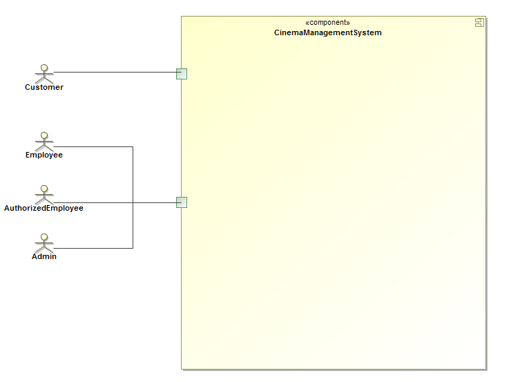

=== 5.2 Top-level Architektur

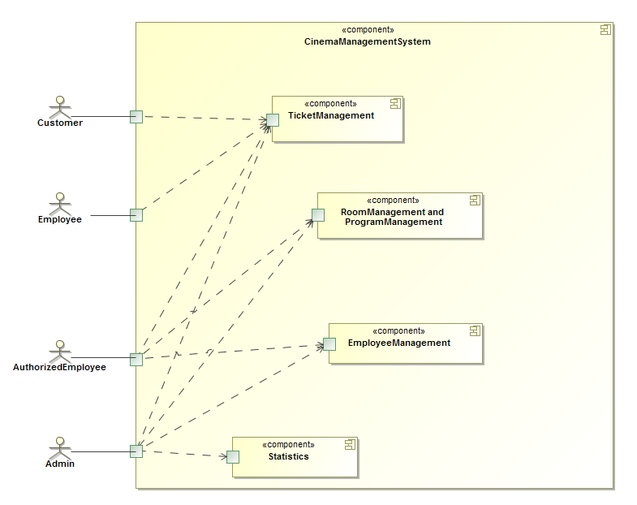

[[anchor6]]
== 6 Anwendungsfälle

=== 6.1 Überblick Anwendungsfalldiagramm
Anwendungsfall-Diagramm, das alle Anwendungsfälle und alle Akteure darstellt:

image::img/Use-Case-Diagramm.PNG[Anwendungsfall-Diagramm]

=== 6.2 Akteure

Akteure sind die Benutzer des Software-Systems oder Nachbarsysteme, welche darauf zugreifen:

// See http://asciidoctor.org/docs/user-manual/#tables
[options="header"]
|===
|Name |Beschreibung 
|Chef|Hat alle Rechte im System
|Autorisiertes Personal| Kann Filme verwalten, Programm bearbeiten und alles was das Personal kann
|Personal|Kann Karten reservieren, verkaufen und umtauschen
|Kunde| Kann online Karten reservieren
|===

=== 6.3 Anwendungsfallbeschreibungen
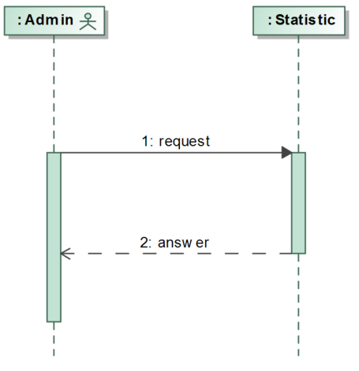
Der Chef will sich nun die Tageseinnahmen ansehen, welche vom System über die Anzahl der verkauften Karten berechnet werden. Auch die Auslastung der Kinosäle bezogen auf den Film wird angezeigt. Monatlich wird anhand der Einnahmen der Umsatz berechnet und dieser wird den Kosten entgegengestellt.

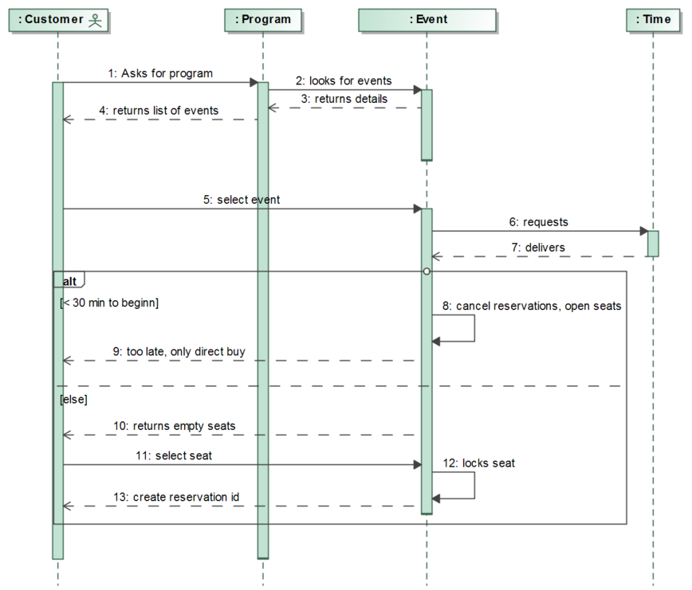
Ein Kunde möchte vom eigenen PC aus eine Kinokarte reservieren. Er öffnet das Online-Portal und blättert im Programm nach seiner gewünschten Vorstellung. Auf der Info-Ansicht der Vorstellung kann er die momentane Sitzplatzbelegung einsehen und einen Platz auswählen.

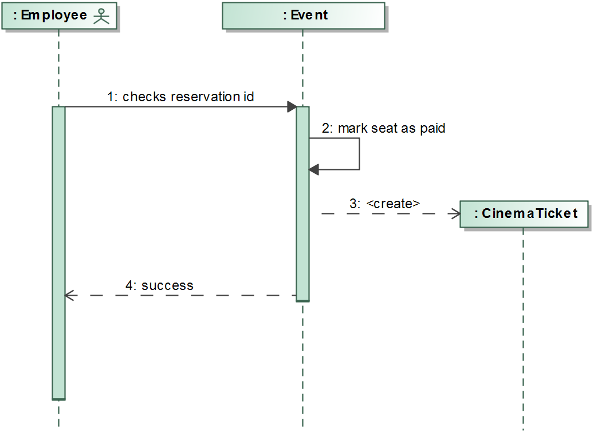
Die ausgedruckte Reservierungs-ID bringt der Kunde zur Kinokasse, bezahlt und bekommt eine Karte im Tausch.

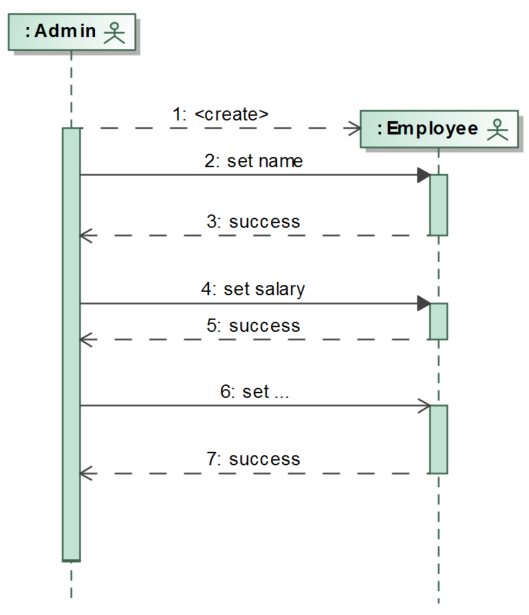
Der Chef stellt ein neues Personalmitglied ein. Er trägt die Personal- und Kontaktdaten der neuen Person und teilt ihr eine Autorisationsstufe und Gehaltsmenge zu. Sie bekommt ein Login und wird einem Kino zugeteilt.

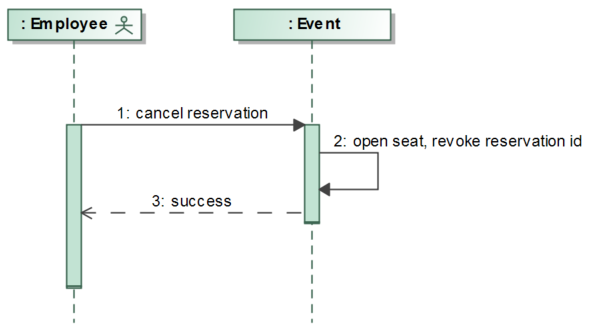
Ein Kunde möchte eine Kinokarte zurückgeben. Das Personalmitglied nimmt die Karte entgegen und prüft die angegebenen Daten von Filmtitel, Kino und Datum mit den im System hinterlegten Informationen. Beträgt die verbleibende Zeit bis zum Vorstellungsstart mehr als 30 Minuten, nimmt das Personalmitglied der Karte entgegen und gibt dem Kunden den auf ihr aufgedruckten Geldbetrag zurück. Er teilt dem System den aufgedruckten Saalplatz zur Freigabe mit. Das System gibt diesen Platz wieder zum Verkauf frei.

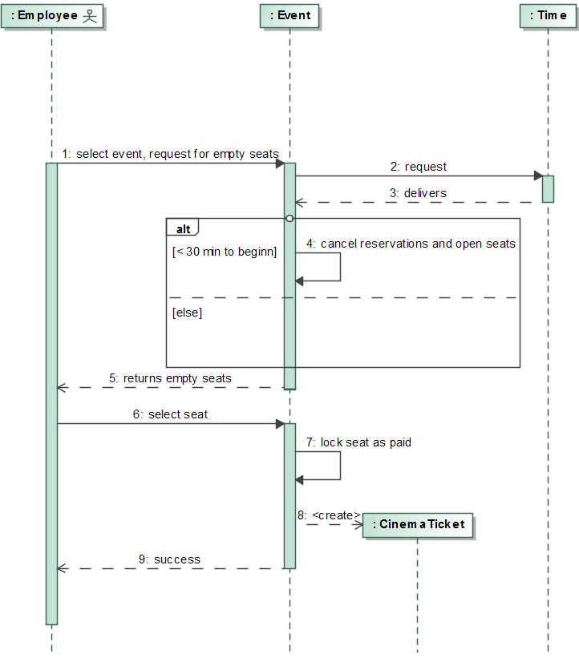
Ein Kunde will eine Kinokarte an der Kasse kaufen. Das Personalmitglied prüft im System, ob für die gewünschte Vorstellung noch Plätze verfügbar sind. Trifft dies zu, dann teilt das Personalmitglied dem System die Preisklasse des Kunden mit, woraus dieses dann den Preis der Kinokarte berechnet. Zahlt der Kunde den Preis, belegt das System einen verfügbaren Platz und druckt eine Kinokarte mit den Informationen über Name und Zeit der Vorstellung, sowie dem zugehörigen Kinosaal, der Platznummer und dem gezahlten Preis aus.

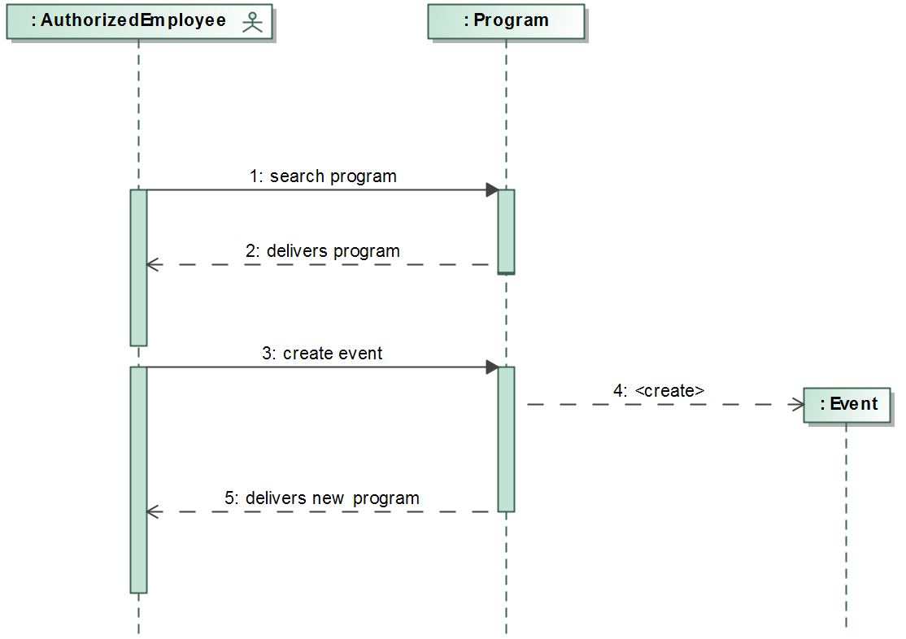
Ein autorisiertes Personalmitglied erstellt eine zusätzliche Filmvorstellung für einen bereits laufenden Film in seinem Kino. Er wählt aus einer vom System bereitgestellten Auswahl an freien Sälen und Zeitslots. Die neu erstellte Vorstellung wird dem Programm für das Kino hinzugefügt und steht nun für den Kartenverkauf bereit.

[[anchor7]]
== 7 Anforderungen

=== 7.1 Muss-Kriterien
* benutzerfreundliche Software, für jedes Kino der Gesellschaft
* 4 Nutzergruppen werden unterschieden: Kunde, Angestellter, Autorisierter Angestellter und Chef
* Der Chef kann das Personal einstellen, befördern, entlassen und bearbeiten
* Die Daten gemieteter Filme können bearbeitet werden
* Autorisiertes Personal kann den Programmablauf aufstellen
* Autorisiertes Personal kann Veranstaltungen erstellen, bearbeiten und löschen
* Der Kunde kann online Veranstaltung sehen und Karten reservieren, wobei er Platz und Preis wählt und seine Reservierung druckt
* Die Platzauswahl wird graphisch über einen Überblick der einzelnen Säle realisiert
* Es gibt zwei Platzgruppen: Parkett und Loge
* Karten können vor Ort an der Kinokasse gekauft, reserviert, storniert, umgetauscht und bezahlt werden
* Angebotenen Statistiken zum Einsehen für den Chef sind:
** monatlicher Umsatz aus Personalkosten, Leihgebühren und Einnahmen
** Tageseinnahmen
** Besucherzahlen
* Daten von vergangenen Veranstaltungen sind ersichtlich
* für den Kauf oder die Reservierung mehrerer Karten gleichzeitig existiert ein Warenkorb
* Kunden können sich einloggen
* Kunden ohne Login müssen für Online-transaktionen ihre Email-Adresse angebeben
* eingegebene Daten werden validiert
* Räume können erstellt, gelöscht und bearbeitet werden
* Reservierungen sind validierbar

=== 7.2 Kann-Kriterien
Anforderungen die das Programm leisten können soll, aber für den korrekten Betrieb entbehrlich sind:

* Mouse-Over-Funktion für Saalübersicht
* Login für Kunden mit Kartenkauf
* Saalvermietung für andersartige Veranstaltungen
* Diagramme und Untermenüs in den Statistiken
* Bild-Upload für Filmerstellung
* Optionsmenu (Accountmanagement)

[[anchor8]]
== 8 GUI Prototyp

=== 8.1 Überblick: Dialoglandkarte

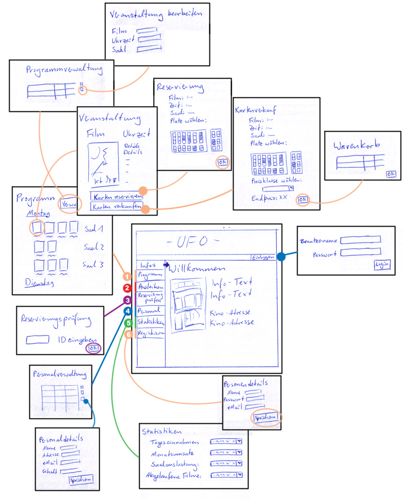

=== 8.2 Dialogbeschreibung

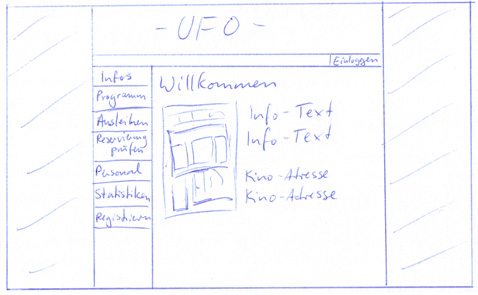

*Willkommen-Seite:*

Dies ist die Hauptseite, die man bei Aufruf der Website zu Sehen bekommt. Sie enthält einen Begrüßungstext, Informationen zu dem Kinogebäude, wie dessen Adresse, und ein Bild des Gebäudes. Ebenfalls bietet sie Zugriff auf den gesamten Inhalt der Website über Schaltflächen am Rand links und oben. Die Schaltflächen besitzen dieselben Funktionen, egal von welcher Seite aus sie benutzt werden.

|===
|Button Info: |öffnet die Willkommen-Seite.
|Button Einloggen: |öffnet die Login-Seite und ist nur sichtbar, wenn man nicht eingeloggt ist. Ansonsten ändert sich der Text der Schaltfläche zu "Ausloggen" und erfüllt die entsprechende Aktion ohne weitere Aufforderungen.
|Button Programm: |öffnet die Programm-Seite.
|Button Ausleihen: |ist nur sichtbar, wenn man mit einer der beiden höchsten Autorisierungsstufen eingeloggt ist, und ist Zugriffspunkt für die externen Listen der Verleihfirmen.
|Button Reservierung prüfen: |ist nicht sichtbar für Kunden und öffnet die Prüf-Seite für Reservierungs-IDs.
|Button Personalverwaltung: |ist nur sichtbar, wenn man mit der höchsten Autorisierungsstufe eingeloggt ist und öffnet die Seite der Personalverwaltung.
|Button Statistiken: |ist nur sichtbar, wenn man mit der höchsten Autorisierungsstufe eingeloggt ist und öffnet die Seite der Statistiken.
|Button Registrieren: |ist nur sichtbar, wenn man nicht eingeloggt ist und öffnet die Registrierungsseite.
|===

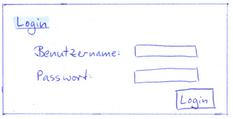

*Login:*

Einfache Dialog-Seite zum Eingeben der Anmelde-Informationen.

|===
|Eingabefeld Benutzername: |nimmt Benutzername entgegen.
|Eingabefeld Passwort: |nimmt Passwort entgegen. Die Buchstaben sind durch Sternchen ersetzt, um die Eingabe unlesbar zu machen.
|Button Login: |führt den Anmelde-Prozess aus.
|===

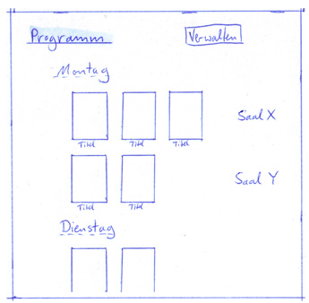

*1 Programm:*

Eine listenartige Ansicht aller in näherer Zukunft in dem Kino laufender Filme.

|===
|Links über Filmplakate: |Jedes Plakat eines Films verlinkt auf die entsprechende Vorstellungs-Seite
|Button Programmverwaltung: |ist nur für eingeloggtes, autorisiertes Personal sichtbar und leitet auf die Programmverwaltungsseite weiter.
|===

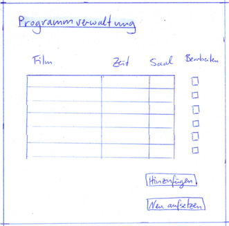

*Programmverwaltung:*

Nur mindestens eingeloggtes autorisiertes Personal kann auf diese Seite zugreifen. Änderungen am aktuellen Programm werden von hier aus durchgeführt.

|===
|Liste Veranstaltungen: |Liste aller aktuell im Programm eingetragenen Veranstaltungen
|Button Bearbeiten: |öffnet Bearbeitungsseite für die Veranstaltung mit vorgefüllten Feldern
|Button Hinzufügen: |öffnet Bearbeitungsseite für eine leere Veranstaltung
|Button Neu aufsetzen: |löscht alle Veranstaltungen im Programm
|===

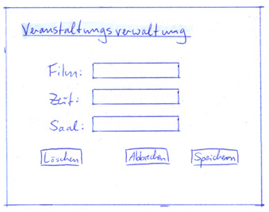

*Veranstaltungsverwaltung:*

Nur mindestens eingeloggtes autorisiertes Personal kann auf diese Seite zugreifen. Änderungen an der gewählten Veranstaltung können hier vorgenommen werden, oder eine neue Veranstaltung wird angelegt.

|===
|Dropdown Uhrzeit: |Auswahl einer Uhrzeit
|Dropdown Saal: |Auswahl eines Saals
|Button Abbrechen: |Verwirft alle Änderungen, zurück zur Seite der Programmverwaltung
|Button Speichern: |Speichert Änderungen oder legt neue Veranstaltung an.
|Button Löschen: |löscht die Veranstaltung aus dem Programm
|===

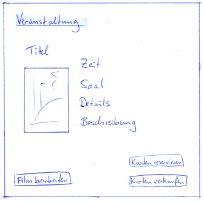

*Veranstaltungsdetails:*

Informationen zu der gewählten Veranstaltung.

|===
|Button Bearbeiten: |nur sichtbar mit Autorisierung. Aktiviert die Möglichkeit, jedes Detail des geöffneten Films zu bearbeiten. Die Änderungen kopieren sich auf alle anderen Vorführungen dieses Films.
|Button Karten reservieren: |öffnet die Reservierungs-Seite
|Button Karten verkaufen: |nur sichtbar für eingeloggtes Personal, öffnet die Verkaufsseite
|===

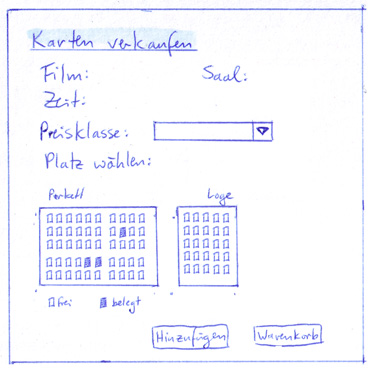

*Karten verkaufen:*

Eingeloggtes Personal jeder Stufe kann auf diese Seite zugreifen. Erlaubt das Verkaufen von Karten, berechnet den Teilpreis und sendet gewählte Karten an den Warenkorb.

|===
|Auswahl Platz: |Graphische Ansicht des Kinosaals, für den die Karte reserviert werden soll. Bereits belegte Plätze sind markiert und können nicht gewählt werden. Ein gewählter Platz wird andersfarbig markiert.
|Dropdown Preisklasse: |Auswahl einer bestimmten Preisklasse
|Button Hinzufügen: |Fügt Karte zum Warenkorb dazu
|Button Warenkorb: |Warenkorb-Seite öffnen
|===

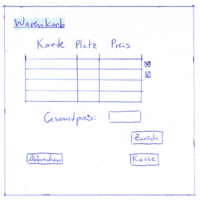

*Warenkorb:*

Sammelt zum Verkauf gewählte Karten, berechnet Gesamtsumme und kommuniziert mit der Kasse.

|===
|Button X: |Karte aus Warenkorb entfernen
|Button Zurück: |zurück zur vorherigen Ansicht ohne weitere Funktion auszuführen
|Button Kasse: |Karten bezahlen und Korb danach leeren
|Button Abbrechen: |Warenkorb leeren und zur vorherigen Ansicht zurückkehren
|===

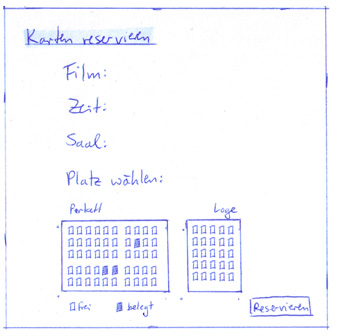

*Karten reservieren:*

Karten können für die gewählte Veranstaltung reserviert werden.

|===
|Auswahl Platz: |Graphische Ansicht des Kinosaals, für den die Karte reserviert werden soll. Bereits belegte Plätze sind markiert und können nicht gewählt werden. Ein gewählter Platz wird andersfarbig markiert.
|Button Reservieren: |öffnet eine druckbare Ansicht der Reservierungskarte.
|===

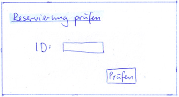

*3 Reservierung prüfen:*

Eingeloggtes Personal jeder Stufe kann auf diese Seite zugreifen. Sie dient zur Überprüfung der Gültigkeit einer Reservierungs-ID.

|===
|Eingabefeld ID: |zum Eintragen der Reservierungs-ID
|Button Prüfen: |sendet die eingetragene ID zum Gültigkeitsvergleich, und leitet entweder auf einen Fehler weiter oder aktiviert die Kasse zum Bezahlen.
|===

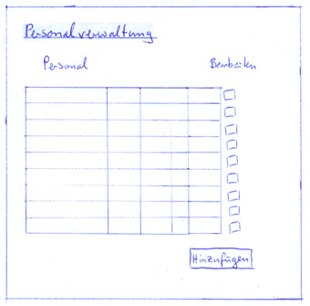

*4 Personalverwaltung:*

Ohne oberste Autorisierungsstufe kann auf diese Seite nicht zugegriffen werden. Bietet Listenansicht aller Angestellten und bietet Möglichkeiten, die zu bearbeiten.

|===
|Liste Personal: |Liste aller aktuell angestellten Mitarbeiter
|Button Bearbeiten: |öffnet die Seite Personaldetails und füllt deren Eingabefelder mit den Details des gewählten Personalmitglieds.
|Button Hinzufügen: |öffnet die Seite Personaldetails mit leeren Eingabefeldern.
|===

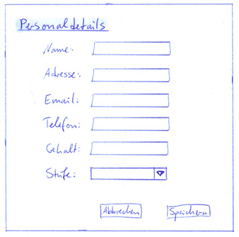

*Personaldetails:*

Ohne oberste Autorisierungsstufe kann auf diese Seite nicht zugegriffen werden. Ermöglicht Bearbeitung eines bestehenden Personalmitglieds oder den Eintrag einer neuen Person.

|===
|Eingabefelder: |Eine Sammlung aller benötigten Eingabefelder für die Informationen, die für neues Personal benötigt werden. Über diese Felder wird auch gleich ein neuer Benutzer für das Personalmitglied angelegt.
|Button Speichern: |Speichert die Änderungen und legt gegebenenfalls einen neuen Personaleintrag an.
|Button Abbrechen: |Verwirft alle Änderungen und öffnet die Personalverwaltungsseite.
|===

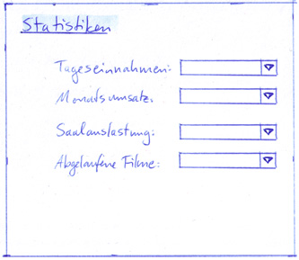

*5 Statistiken:*

Ohne oberste Autorisierungsstufe kann auf diese Seite nicht zugegriffen werden. Zugangsportal zu den verschiedenen Statistik-Ansichten.

|===
|Dropdown Tageseinnahmen: |Auswahlmöglichkeit für einen bestimmten Tag
|Dropdown Monatsumsatz: |Auswahlmöglichkeit für einen bestimmten Monat
|Dropdown Saalauslastung: |Auswahlmöglichkeit für einen bestimmten Film
|Dropdown Abgelaufene Filme: |Auswahlmöglichkeit für einen bestimmten Film
|===

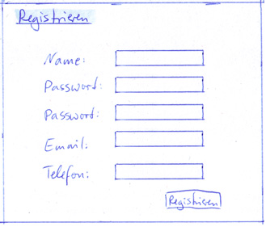

*6 Registrieren:*

Sichtbar nur, wenn man nicht eingeloggt ist. Bietet Eingabefelder zum Anlegen eines Accounts.

|===
|Eingabefeld Name: |für Vor- und Nachname des Benutzers.
|Eingabefeld Benutzername: |für den gewünschten Einlogg-Namen des Benutzers.
|Eingabefeld Passwort: |Ersteingabe des gewünschten Passworts. Die Buchstaben sind durch Sternchen ersetzt, um die Eingabe unlesbar zu machen.
|Eingabefeld Passwort wiederholen: |Zweiteingabe des gewünschten Passworts zur Überprüfung der Schreibung. Die Buchstaben sind durch Sternchen ersetzt, um die Eingabe unlesbar zu machen.
|Eingabefeld Email: |für die E-Mail-Adresse, über die der Benutzer kontaktiert werden möchte
|Eingabefeld Telefonnummer: |für die Telefonnummer, über die der Benutzer kontaktiert werden möchte
|===

[[anchor9]]
== 9 Datenmodell

=== 9.1 Überblick: Klassendiagramm
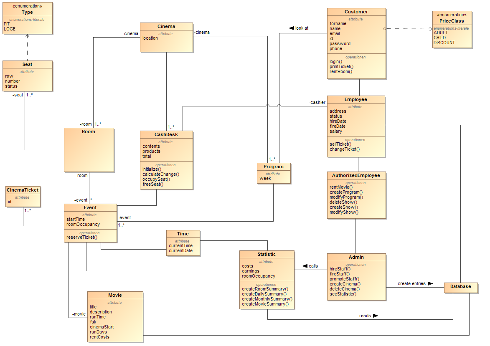

=== 9.2 Klassen und Enumerationen
Dieser Abschnitt stellt eine Vereinigung von Glossar und der Beschreibung von Klassen/Enumerationen dar. Jede Klasse und Enumeration wird in Form eines Glossars textuell beschrieben.

// See http://asciidoctor.org/docs/user-manual/#tables
[options="header"]
|===
|Klasse/Enumeration |Beschreibung
|Customer             |Kann nur Infos über das Kino und das Programm einsehen, und Karten reservieren. Ein Login ist dafür nicht erforderlich. Bei Login werden Name, Email, Passwort und Telefonnummer gespeichert.
|Employee             |Erbt von Customer. Kann Karten direkt verkaufen, tauschen, zurücknehmen oder reservieren. Besitzt zusätzlich Informationen über Adresse, Beschäftigungszeitraum und Gehalt.
|AuthorizedEmployee   |Erbt von Employee. Kann Filme mieten und das Programm bearbeiten.
|Admin                |Erbt von AuthorizedEmployee. Kann Personal einstellen und entlassen, und alle Daten und Statistiken einsehen.
|CashDesk             |Stellt die Kinokasse dar und ist verantwortlich für alle Geldangelegenheiten        
|Room                 |Hat eine bestimmte Menge Plätze.
|Cinema               |Hat einen Ort, Räume und ein Programm.
|Event                |Filmvorstellung mit Angaben über Raum, Film, Uhrzeit.
|Program              |Liste der Veranstaltungen in einer bestimmten Woche.
|Time                 |Management von zeitabhängigen Ereignissen. Hilft bei Veranstaltungserstellung.
|Statistic            |Zeigt Informationen berechnet aus Einnahmen und Ausgaben.
|Movie                |Besitzt Informationen zum eigenen Titel, Laufzeit, FKS-Freigabe, Kinostart, Leihgebühren und eine Kurzbeschreibung.
|Seat                 |Hat eine Reihe und Nummer, und steht in einem bestimmten Raum. Sitze sind entweder belegt oder frei.
|Ticket               |Kinokarte mit Platznummer, Raum, Film, Uhrzeit, Karten-ID.
|Type                 |Enumeration über den Typ des gewählten Platzes - Parkett oder Loge
|PriceClass           |Enumeration über die Preisklasse des Kunden. Erwachsener, Kind und Schwerbehinderter sind als erste Werte vorgegeben.
|===

[[anchor10]]
== 10 Aktzeptanztestfälle
Mithilfe von Akzeptanztests wird geprüft, ob die Software die funktionalen Erwartungen und Anforderungen im Gebrauch erfüllt.

|===
|ID |Test
|01 |Login ist nur mit entsprechendem Passwort möglich
|02 |Login erteilt die richtige Nutzergruppe für den Anmeldenamen
|03 |Nutzer bleiben eingeloggt bis sie sich abmelden
|04 |Nutzer einer Gruppe können nur auf die ihnen zugeteilten Funktionen zugreifen
|05 |Reservierte Karten können nicht nochmals reserviert oder verkauft werden
|06 |Verkaufte oder reservierte Karten ändern ihren Zustand nicht mit Neu laden der Website
|07 |Verkauf oder Reservierung ist nicht ohne Platzauswahl möglich
|08 |Bei Rückgabe einer Karte oder Ablauf einer Reservierung wird der Platz korrekt freigegeben
|09 |Eine Reservierungs-ID wird an der Kinokasse korrekt erkannt
|10 |Eine gedruckte Kinokarte enthält die korrekten Informationen
|11 |Reservierungen laufen 30min vor Vorstellungsbeginn ab
|12 |Karten können 30min vor Vorstellungsbeginn nicht zurückgenommen werden
|13 |Der Monatsumsatz wird korrekt berechnet
|14 |Leere Textfelder bei Eingabeauforderungen liefern einen Fehler und werden nicht durchgeführt
|15 |Vorstellungen können gelöscht werden
|16 |Reservierungen laufen 30min vor Vorstellungsbeginn ab
|===
